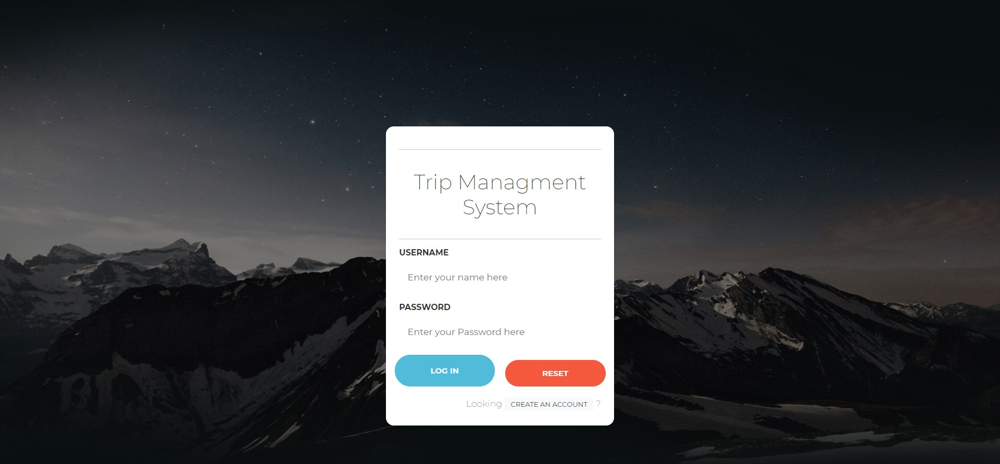
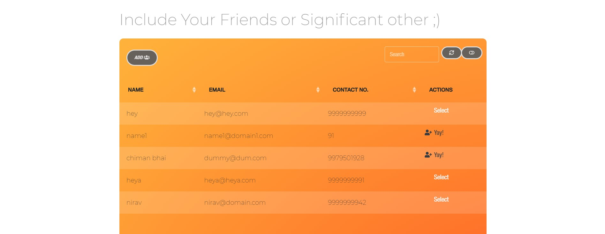
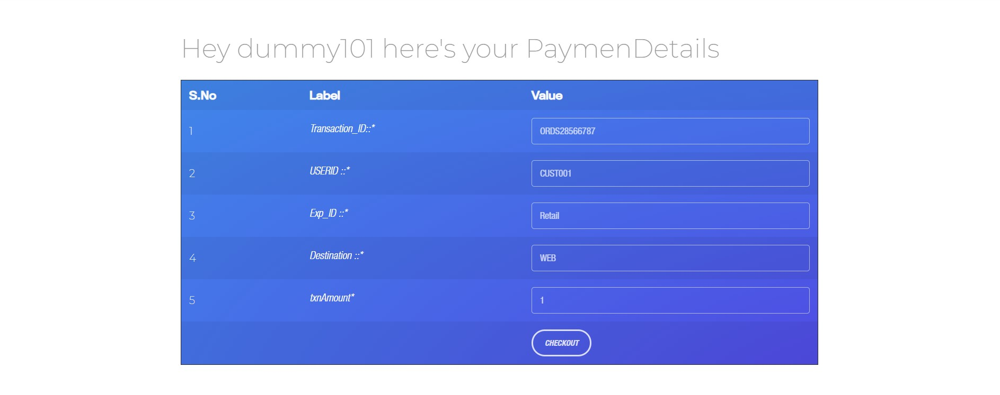
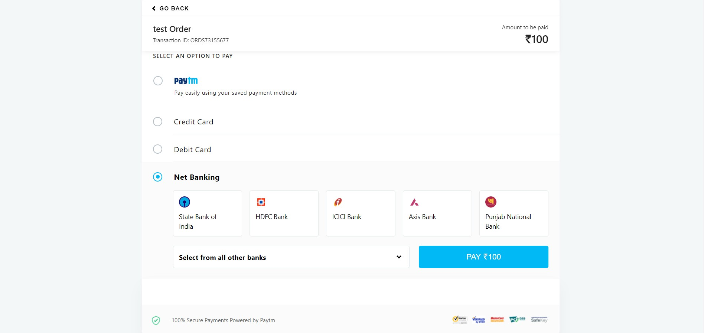
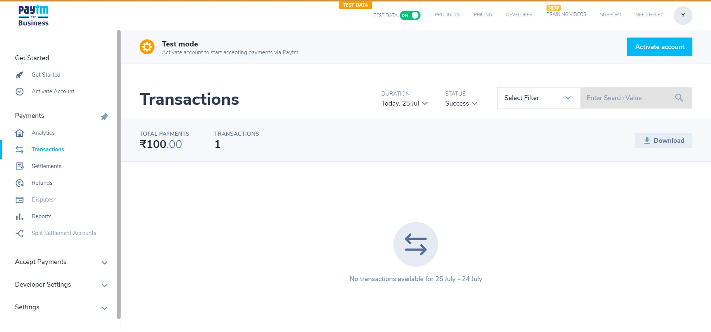

# Trip-Managment-System (Mini Project)
The basic trip booking,tracking expense and payment gateway mini project

### Dependencies
- Paperkit by creative Tim:
  -  src: https://demos.creative-tim.com/paper-kit-2/
- Pretty checkbox:
  -  src: https://lokesh-coder.github.io/pretty-checkbox/
- Image Reveal Hover Effects:
  -  src: https://tympanus.net/codrops/2018/11/27/image-reveal-hover-effects/
- PayTm:
  -  src: https://developer.paytm.com/docs/
###  How to install the sample kit on a web server:
1.   Copy PaytmKit folder in document root of your server (like /var/www/html)
2.   Open config_paytm.php file from the PaytmKit/lib folder and update the below constant values
-     PAYTM_MERCHANT_KEY – Provided by Paytm
-     PAYTM_MERCHANT_MID - Provided by Paytm
-     PAYTM_MERCHANT_WEBSITE - Provided by Paytm
3.   PaytmKit folder is having following files:
-     TxnTest.php – Testing transaction through Paytm gateway.
-     pgRedirect.php – This file has the logic of checksum generation and passing all required parameters to Paytm PG. 
-     pgResponse.php – This file has the logic for processing PG response after the transaction        processing.
-     TxnStatus.php – Testing Status Query API

###  For Offline(Wallet Api) Checksum Utility below are the methods:
  1.  getChecksumFromString : For generating the checksum
  2.  verifychecksum_eFromStr : For verifing the checksum

###  To generate refund checksum in PHP :
  1.  Create an array with key value pair of following paytm parameters 
     (MID, ORDERID, TXNTYPE, REFUNDAMOUNT, TXNID, REFID)
  2.  To generate checksum, call the following method. This function returns the checksum as a string.
     getRefundChecksumFromArray($arrayList, $key, $sort=1)
### The workspace dir snapshot

# Here's some project sneek peek...
### log in...

### Register Account...

### Register Package (Admin Side)...

### Home Page...

### Choose Package...

### Planning/Managing Trip Expenses 

    
    

### PayTm as Payment Gateway

    
    

